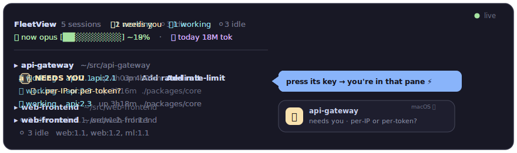
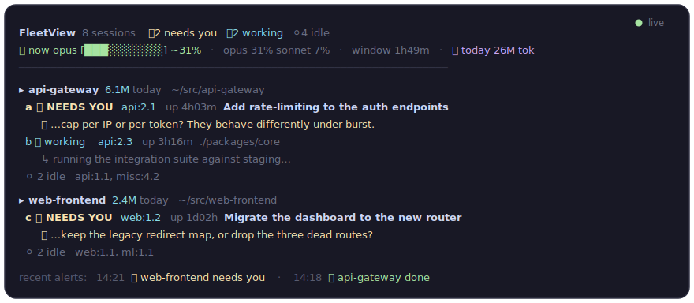

<div align="center">

# FleetView

### 再也不会漏掉一个在等你的 Claude Code 会话。

同时开着十几个 `claude` 终端?FleetView 把它们全摆进**一块看板**,把在等你的那个
**置顶**,谁需要你就立刻发一条**原生 macOS 通知** —— 然后**一个按键**把你送进它的 pane。

[](LICENSE)
[](#-快速开始)
[](#-功能)
[](#)
[](#-配置)

[English](README.md) · **简体中文**



</div>

你一个终端接一个终端地手动开 `claude`,然后就跟丢了 —— *到底哪个现在在等我?* 最后只能在
一堆长得一模一样的标签页之间来回 alt-tab,去找那个十分钟前悄悄问了你一句的会话。

**FleetView 就是把它们全装进一块常驻看板。** 需要你的会话浮到最上面,谁一需要你就给你一条
macOS 通知,一个按键就把你丢进对应的 pane。不用 `pip install`、没有常驻进程、没有配置文件
—— 纯 Python 标准库。clone 下来,跑 `fleet`,完事。

## ✨ 功能

- 🔔 **原生 macOS 通知。** 一个会话刚结束一轮、或者抛了个问题,你立刻收到一条真正的 macOS
  通知 —— 哪怕 Claude 在后台、哪怕你正在用别的 App。标题以项目名打头;如果是文字提问,**问题
  本身**就放进通知里。想让它在屏幕上多停一会?加 `--sticky`。
- 🗂️ **所有会话一块看板。** 你手动开的所有 `claude` 终端,按项目分组,**在等你的置顶**。
  空闲终端折叠成一行,盖不住真正要紧的那几行。
- 🎯 **一键跳转。** 点一行、或按它的字母,你就被传送进那个 tmux pane —— 不用再在一堆标签页
  里翻找。**零配置:**不用 hook、不用环境变量、不用装任何东西。
- 💬 **看清每个会话在干嘛。** 每一行都显示会话的标题和最新一句话。而 Claude 留给你的纯文字
  提问 —— 这种本来只会显示成「idle」—— 会被**抓出来并置顶**成「需要你」。
- 📊 **知道自己压得多狠。** 一个按模型分、滚动 5 小时窗口的实时用量仪表,数据来自整个 fleet
  的真实 token 计数。
- 🌐 **中文 / English**(`--lang` 或 `FLEET_LANG`)· 🪶 **零安装、零依赖** —— 纯标准库
  Python 3,不动你系统里的任何东西。

## 🤔 为什么不直接用 `claude agents`?

官方的 `claude agents` **TUI 只列_后台_会话**(你用 `claude --bg` / `/bg` 派发的那些)。
你在每个终端里**手动开的、真正需要你盯着的交互式会话,根本不在那里面。** FleetView 显示的
正是这些。

## 🎬 实际效果

一个更完整的 fleet:两个会话在等你(连它们问的问题一起)、空闲终端折叠收起、一条按模型分的
实时用量行,还有最近提醒的滚动条。

<div align="center">

</div>

## 🚀 快速开始

```bash
git clone https://github.com/jity16/Fleet_ClaudeCode.git
cd Fleet_ClaudeCode

# 加一个 `fleet` 快捷命令(会帮你写好绝对路径)
echo "alias fleet=\"python3 $(pwd)/fleet_board.py\"" >> ~/.zshrc && source ~/.zshrc

fleet
```

就这样 —— 看板起来,开始盯着每个会话,通知默认开着。(不想用 alias?直接
`python3 fleet_board.py` 或 `./fleet`。用 bash 的话改 `~/.bashrc`。)

> **环境要求** Python 3.7+、Claude Code ≥ v2.1.139、macOS(为了通知和标签页跳转)。
> `tmux` 可选,但跳到 pane 需要它。

## ⚙️ 配置

一切都是命令行参数 —— 没有配置文件。裸跑 `fleet` 就是推荐配置;其余都是可选。

| 命令 | 作用 |
| :--- | :--- |
| `fleet` | 实时看板,每 2 秒刷新,**通知开**。 |
| `fleet --lang en` | 英文界面(见[语言](#语言))。 |
| `fleet jump` | 跳到在等你的那个会话。 |
| `fleet jump <pid\|target>` | 跳到指定会话(pid 或 `sess:win.pane`)。 |
| `fleet --headless &` | 只做通知 —— 没有看板,只 ping。可 `nohup`。 |
| `fleet --sticky` | 持久弹窗,停留到你手动关掉(约 60 秒)。 |
| `fleet --all` | 把每个空闲会话单独列出(默认折叠)。 |
| `fleet --once` | 渲染一帧就退出。 |
| `fleet --no-notify` | 只看板,不通知。 |
| `fleet --interval N` | 每 `N` 秒刷新(默认 2)。 |
| `fleet --usage` | 一次性详细用量报告,然后退出。 |
| `fleet --budget 20M` | 给 `现在` 仪表用一个固定的加权 5h 上限。 |
| `fleet --no-usage` | 隐藏用量行。 |
| `fleet --test-notify` | 发一条测试通知(确认 macOS 放行)。 |

### 让通知弹出来(并停留)

macOS 横幅(banner)按系统策略几秒就自动消失。两种留住它的办法:

- **`fleet --sticky`** —— 通知变成持久弹窗,停到你手动关掉(或约 60 秒)。不用改系统设置。
- **改成 Alerts 样式** —— *系统设置 → 通知 → Script Editor* → 把样式设为 **提醒(Alerts)**
  (而不是横幅)。

如果压根不弹,先跑 `fleet --test-notify`,然后在*系统设置 → 通知*里给 **Script Editor**
(osascript)允许通知。

### 语言

界面支持**中文**和 **English**,按以下顺序决定:

```bash
fleet --lang en           # 1. 显式参数(本次运行)
export FLEET_LANG=zh      # 2. 环境变量(每次运行)
# 3. 你的 locale($LANG / $LC_ALL 以 "zh" 开头 → 中文)
# 4. 英文
```

### 把 `jump` 绑到 tmux 按键

这样一个组合键就能把你拉到正在等你的那个会话,连看板都不用看:

```tmux
# ~/.tmux.conf  →  prefix + J 跳到在等你的会话
bind-key J run-shell "python3 /path/to/fleet_board.py jump"
```

## ⚠️ 须知

- **通知和标签页跳转仅限 macOS。** 看板本身在哪能跑 Python 就在哪能跑;通知走 macOS,
  跳到 pane 需要 `tmux`。
- **用量仪表是_估算_,不是你官方的套餐额度 %。** Anthropic 真实的 `/usage` 数字不对脚本
  开放,所以 FleetView 用本地 token 计数来估算(而且绝不碰你的凭证)。摸清真实上限后可以用
  `--budget <N>` 校准。

## 参与贡献

欢迎提 Issue 和 PR —— 这是一个小巧、零依赖的代码库。本 README 里的演示图都是
[`assets/`](assets) 目录下手写的 SVG,所以它们和工具实际画出来的东西保持一致。

## 许可证

[MIT](LICENSE) © jity16
